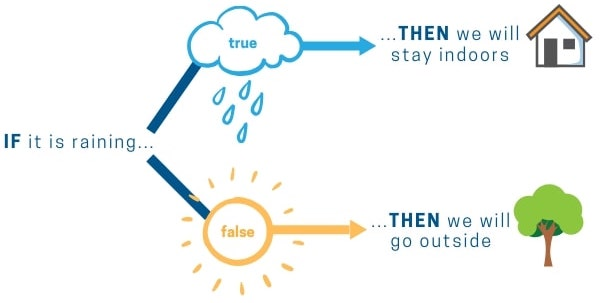

# Conditional



Conditions are basic “if, then” logic statements that modify how code is executed. Conditions are a key part of the decision-making process for computers.

# Equality Expression
```js
a = true
b = a * 2 >= 12
```

List of mathematical support
* `==` : Equal
* `!=` : Different
* `<` : Less than
* `<=` : Less or equal than
* `>` : More than
* `>=` : More or equal than

And they can be combined logic operator
* `and`
* `or`

# If Statement

## Syntax
```js
if [expr] { [block] }
elif [expr] { [block] }
else { [block] }
```

## Example
```js
if a / 2 >= 10 and b == "test" {
  @print("this is too much")
} elif a > 8 {
  @print("almost")
} elif a > 6 {
  @print("..")
} else {
  @print(".")
}
```
